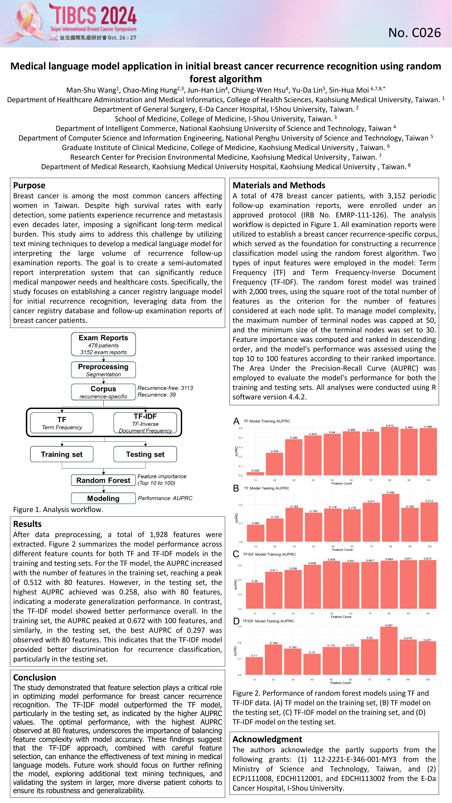
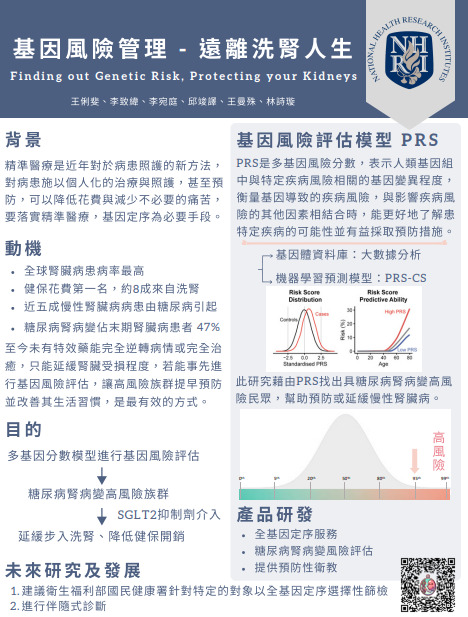

# 備審資料

## **期末專題**
### 主題：智能化肌腱斷裂輔助診斷系統

---

## **個人專題**
### TIBCS2024 論文壁報主題：Medical language model application in initial breast cancer recurrence recognition using random forest algorithm

---

## **競賽經歷**
### DIGI*XTCA 全球數位新星大賞競賽
- 由財團法人國家衛生研究院指導，參加數位發展部數位產業署112年度跨域數位人才加速躍升計畫辦理之競賽
- 主題：基因風險管理-遠離洗腎人生 Finding out Genetic Risk, Protecting your Kidneys

---

## **比較特別的修課經歷**
### 跨領域學習經驗
- 我是一個很喜歡跨領域的人，在大學期間修了不少學分學程，其中最讓我印象深刻的是**臨床試驗微學程**中的**臨床新藥之研發特論**。  
- 雖然我不是醫學或藥學背景，但在這門課中，我很積極地和老師同學討論，也將自己喜愛的 AI 結合臨床作為報告之一。  
- 我期許自己未來能在醫學資訊這個領域發光發熱！
### 學分學程
- AI醫療與健康照護微學程  
- 呼吸健康管理微學程
- 高齡照顧入門微學程
- 醫療數據應用微學程

[查看期末專題海報 PDF](https://drive.google.com/file/d/12G-4sa8mvsyHY4jE7ANDi-Svui_EkL7W/view?usp=sharing)

---

## **課外活動經歷**
1. 擔任**國際志工社社長**
2. 擔任**學生大使**
3. 擔任**高雄市政府青年局國際志工**

---

## **工讀經歷**
1. 我很喜歡服務他人，在校內老師的引薦之下，我到鹽埕區的一所國小，定期協助課堂手作實驗。  
   - 讓學生能夠輕鬆地學習，並樂於發問。
2. 此外，我也曾擔任**線上課輔**，為偏鄉地區的國中生進行視訊輔導：  
   - 協助學生完成當日作業  
   - 規劃符合她需求的複習進度  
